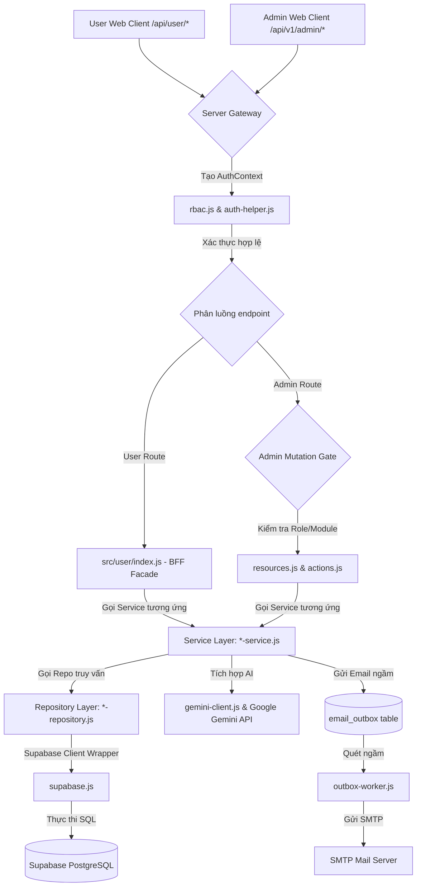
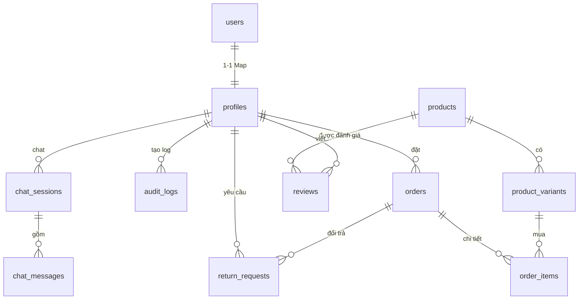

# BÁO CÁO CHI TIẾT KIẾN TRÚC BACKEND HỆ THỐNG VELURA

## 5.3. Xây dựng Backend

### 5.3.1. Kiến trúc Backend tổng thể
Hệ thống Backend của Velura đóng vai trò trung gian cốt lõi (BFF - Backend For Frontend kiêm API Gateway), chịu trách nhiệm xử lý toàn bộ logic nghiệp vụ, quản lý trạng thái, đồng bộ dữ liệu, phân quyền bảo mật và kết nối các dịch vụ bên ngoài. 

Sơ đồ dưới đây minh họa luồng xử lý yêu cầu (Request Flow) từ Client đến các lớp xử lý của Backend:



---

### 5.3.2. Mô hình kiến trúc phần mềm
Backend Velura được xây dựng trên nền tảng **Node.js HTTP Native (`node:http`)** để đạt hiệu năng tối đa mà không phụ thuộc vào các framework cồng kềnh như Express. Hệ thống áp dụng nghiêm ngặt mô hình **Kiến trúc đa tầng (Layered Architecture)** kết hợp với **Thiết kế hướng miền (Domain-Driven Design - DDD)** ở mức cơ bản:

1. **Routing Layer (Tầng định tuyến - `server.js`, `*-router.js`):** Tiếp nhận các kết nối TCP/HTTP thô, phân tách pathname và query string, thực thi middleware CORS, ghi nhận IP người dùng và phân luồng xử lý.
2. **Security Layer (Tầng bảo mật - `rbac.js`, `auth-helper.js`, `rate-limit.js`):** Chịu trách nhiệm trích xuất JWT từ Header `Authorization`, giải mã thông tin định danh, kiểm tra trạng thái hoạt động của tài khoản, áp dụng Rate Limiting chống spam, và kiểm tra quyền truy cập tài nguyên (RBAC).
3. **Service Layer (Tầng nghiệp vụ - `*-service.js`):** Chứa các luật nghiệp vụ (Business Logic/Rules) tinh túy của hệ thống. Tầng này độc lập với môi trường HTTP và Database; nó chỉ tương tác qua tham số đầu vào và gọi xuống các Repository.
4. **Repository Layer (Tầng truy cập dữ liệu - `*-repository.js`, `supabase.js`):** Che giấu logic truy vấn cơ sở dữ liệu. Mọi thay đổi về cấu trúc bảng hoặc công nghệ lưu trữ chỉ ảnh hưởng đến tầng này, giúp giữ cho Service Layer luôn ổn định.
5. **External Integration Layer (Tầng tích hợp ngoại vi - `gemini-client.js`, `outbox-worker.js`):** Giao tiếp với các bên thứ ba như hệ thống AI của Google (Gemini) hay máy chủ SMTP để gửi email.

---

### 5.3.3. Cấu trúc mã nguồn Backend chi tiết
Thư mục gốc của Backend (`apps/api/src/`) được phân bổ rõ ràng như sau:

#### 5.3.3.1. Các file lõi hệ thống (Core Root Files)
Nằm tại thư mục gốc `src/`, chịu trách nhiệm vận hành hệ thống chạy ổn định và an toàn:
- **`server.js`**: File khởi chạy chính của Backend. Thực hiện nạp cấu hình, cấu hình CORS, thiết lập Dependency Injection (truyền các Repo vào các Service để tránh việc khởi tạo chồng chéo), và phân chia routing tổng.
- **`http.js`**: Bộ công cụ tiện ích xử lý HTTP thuần (Native). Viết lại hàm `parseJsonBody` để đọc stream dữ liệu, hàm `sendJson` để chuẩn hóa response đầu ra, cấu hình CORS Headers toàn cục, và quản lý đối tượng `HttpError` tập trung.
- **`config.js`**: Khởi tạo và xác thực tính toàn vẹn của các biến môi trường (`PORT`, `SUPABASE_URL`, `GEMINI_API_KEY`, v.v.). Nếu thiếu các biến cốt lõi, server sẽ từ chối khởi động (Fail-fast).
- **`rbac.js`**: Hệ thống kiểm soát truy cập dựa trên vai trò. Định nghĩa quyền truy cập trang (`rolePages`) và quyền gọi API nghiệp vụ (`roleModules`) cho từng nhóm chức vụ Admin.
- **`auth-helper.js`**: Chứa các hàm tiện ích mã hóa mật khẩu (`hashPassword`, `comparePassword`), ký và xác thực JWT token (`signJwt`, `verifyJwt`), hỗ trợ làm sạch payload.
- **`supabase.js`**: Wrapper bọc ngoài Supabase REST Client, cung cấp các hàm trợ giúp truy vấn nhanh (`selectRows`, `selectOne`, `insertRow`, `updateRows`, `deleteRows`) giúp tối giản hóa mã nguồn trong Repository.
- **`resources.js`**: Đóng vai trò là file cấu hình khai báo (Declarative configuration) ánh xạ từ API Endpoint Admin sang các bảng dữ liệu Supabase, định nghĩa cột tìm kiếm (`searchColumns`), thứ tự sắp xếp mặc định và tự động build các câu lệnh truy vấn phân trang (`buildListQuery`).
- **`actions.js`**: Điểm tiếp nhận trung tâm của mọi thay đổi (Mutations) từ phía Admin. Sử dụng cơ chế kiểm soát phiên bản **Optimistic Concurrency Control (OCC)** để tránh ghi đè dữ liệu khi nhiều Admin cùng thao tác một lúc, đồng thời tự động trigger hàm ghi Audit Log.
- **`audit.js`**: Chứa hàm `writeAuditLog` để lưu vết lịch sử mọi hành vi tác động của Admin xuống bảng `audit_logs` phục vụ mục đích bảo mật hệ thống.
- **`rate-limit.js`**: Thiết lập bộ đếm giới hạn tần suất yêu cầu (Rate Limiter) trong bộ nhớ RAM (In-memory) áp dụng cho các route nhạy cảm như Chatbot, Checkout.
- **`dashboard.js`**: Thực thi các truy vấn SQL tổng hợp nâng cao để lấy số liệu doanh thu, số đơn hàng thành công, tỉ lệ đổi trả để cung cấp cho Dashboard.
- **`gemini-client.js`**: Kết nối và điều phối các tham số gửi lên Gemini API (Temperature, System Instructions, Safety Settings).
- **`recommendation-service.js` & `recommendation.controller.js`**: Module chuyên xử lý logic AI Outfit Recommendation (gợi ý phối đồ) bằng cách lấy thông tin giỏ hàng/lịch sử mua sắm của User đưa vào Context gửi cho Gemini.
- **`v1-wishlist-routes.js`**: Module route độc lập xử lý nhanh danh sách yêu thích của người dùng trên phiên bản API v1.

#### 5.3.3.2. Cấu trúc chuẩn 3 lớp của các Domain Modules (Thư mục nghiệp vụ)
Các thư mục nghiệp vụ được cô lập hóa thành từng thư mục con tại thư mục gốc, bao gồm:
- **`src/accounts/`**: Quản lý hồ sơ người dùng, phân vai trò Admin. Chứa file `account-maintenance.js` để dọn dẹp các tài khoản ảo/tạm thời ngầm định kỳ.
- **`src/products/`**: Quản lý thông tin sản phẩm, danh mục, thuộc tính biến thể (size, màu sắc) và số lượng tồn kho.
- **`src/orders/`**: Quản lý quy trình đặt hàng, xử lý giỏ hàng và chuyển đổi trạng thái đơn hàng.
- **`src/returns/`**: Quản lý toàn bộ tiến trình xử lý yêu cầu Đổi/Trả hàng của khách, ghi nhận trạng thái từ `pending` đến `completed/rejected`.
- **`src/reviews/`**: Quản lý bình luận, chấm sao đánh giá sản phẩm và duyệt hiển thị.
- **`src/pricing/`**: Bộ công cụ tính toán giá tiền linh hoạt, áp dụng mã giảm giá (voucher), combo sản phẩm (bundles) và phân bổ ngân sách khuyến mãi.
- **`src/chatbot/`**: Xử lý logic chatbot thời gian thực, lưu trữ lịch sử hội thoại.
- **`src/content/`**: Quản lý nội dung hiển thị tĩnh: Blog, Banner quảng cáo, các trang chính sách.
- **`src/audit-logs/`**: Cung cấp giao diện truy vấn lịch sử hành động hệ thống dành riêng cho Super Admin.

Mỗi thư mục trên (ví dụ: `src/products/`) được tổ chức thành 4 file tách biệt trách nhiệm:
1. **`*-constants.js`**: Khai báo các hằng số nghiệp vụ, các Enum trạng thái (ví dụ: trạng thái đơn hàng `pending`, `confirmed`, `shipping`, `completed`).
2. **`*-router.js`**: Đọc dữ liệu từ HTTP, áp dụng RBAC Guard, gọi Service xử lý và trả kết quả JSON về cho client.
3. **`*-service.js`**: Nơi thực hiện kiểm tra logic nghiệp vụ (ví dụ: Số lượng biến thể còn đủ trong kho không, Voucher có còn hạn sử dụng không).
4. **`*-repository.js`**: Chứa các hàm truy cập cơ sở dữ liệu Supabase phục vụ riêng cho nghiệp vụ đó.

#### 5.3.3.3. Các Module tích hợp ngoại vi và chạy ngầm (External & Background Workers)
- **`src/email/` (Chứa `outbox-worker.js`)**: Thực thi mô hình kiến trúc **Outbox Pattern**. Khi hệ thống có sự kiện cần gửi mail (ví dụ: Đặt hàng thành công), Service sẽ lưu thông tin mail vào bảng `email_outbox` trong cùng một Transaction xử lý đơn hàng. File `outbox-worker.js` sẽ chạy ngầm định kỳ quét bảng này, kết nối với SMTP Server bên ngoài để gửi mail bất đồng bộ, giúp giải phóng API chính lập tức mà không sợ mất thư nếu mạng SMTP bị lỗi.

#### 5.3.3.4. Tầng giao tiếp Khách hàng (BFF Layer) - Thư mục `src/user/`
Thư mục `src/user/` hoạt động như một tầng **BFF (Backend-For-Frontend)** độc lập, chuyên tiếp nhận và xử lý các yêu cầu từ trang Web khách hàng (`user-web`) thông qua endpoint `/api/user/*`. 

Tầng này được điều phối tập trung bởi file Facade **`src/user/index.js`**, chịu trách nhiệm phân luồng đến các module con chuyên biệt:
- **`auth.js`**: Đăng ký khách hàng mới, đăng nhập, khôi phục mật khẩu và gia hạn Session Token.
- **`profile.js`**: Cho phép khách hàng cập nhật thông tin cá nhân và quản lý danh sách địa chỉ nhận hàng (`saved_addresses`).
- **`cart.js`**: Đồng bộ giỏ hàng thời gian thực giữa Client và Database.
- **`products.js`**: Hỗ trợ khách hàng tìm kiếm, lọc sản phẩm theo danh mục, mức giá, kích cỡ (chỉ hiển thị sản phẩm trạng thái `active`, giấu các sản phẩm nháp hoặc đã ngừng bán).
- **`orders.js`**: Hỗ trợ khách đặt hàng (checkout), tra cứu lịch sử mua hàng cá nhân và tự hủy đơn hàng nếu đơn hàng chưa được xác nhận.
- **`returns.js`**: Nhận yêu cầu Đổi/Trả hàng của khách hàng (truyền kèm lý do chi tiết như màu sắc, size mong muốn đổi).
- **`reviews.js`**: Cho phép khách hàng gửi đánh giá sau khi đơn hàng chuyển sang trạng thái thành công (`delivered`).
- **`quiz.js`**: Nhận dữ liệu trắc nghiệm phong cách và lưu trữ Style Profile của khách hàng.
- **`wishlist.js`**: Lưu và xóa danh sách sản phẩm yêu thích cá nhân.
- **`notifications.js`**: Cung cấp API cập nhật trạng thái thông báo đơn hàng của người dùng.
- **`upload.js`**: Tầng Proxy trung gian. Tiếp nhận file ảnh minh chứng đổi trả từ client thông qua luồng parser Multipart dữ liệu thô tự xây dựng (`parseMultipartFile`), sau đó tải trực tiếp lên Supabase Storage dưới dạng Stream an toàn.

---

### 5.3.4. Cơ chế phân luồng Routing tách biệt Admin và User
Để đảm bảo tính bảo mật tuyệt đối, hệ thống thực hiện phân luồng nghiêm ngặt ngay tại entrypoint `server.js`:

```javascript
// Trích xuất luồng phân tuyến trong src/server.js
const parts = pathname.split("/").filter(Boolean); // ví dụ: ["api", "user", "orders"] hoặc ["api", "v1", "admin", "products"]

if (parts[1] === "user") {
  // 1. Phân luồng luồng khách hàng (User Web BFF)
  // Chỉ yêu cầu xác thực JWT nếu endpoint không thuộc luồng đăng nhập/đăng ký
  const context = await buildAuthContext(req);
  return await handleUserRoute(req, res, parts, corsHeaders, context);
} 
else if (parts[1] === "v1" && parts[2] === "admin") {
  // 2. Phân luồng luồng quản trị (Admin Web API)
  const context = await buildAuthContext(req);
  
  // Áp dụng lớp Guard bảo mật bắt buộc
  requireAdmin(context); // Bắt buộc phải là tài khoản có flag role = 'admin' và is_active = true
  
  // Áp dụng Rate Limiting bảo vệ cho các thao tác sửa đổi (POST, PATCH, DELETE)
  if (["POST", "PATCH", "DELETE"].includes(req.method)) {
    await mutationLimiter.check(req);
  }
  
  // Phân bổ định tuyến dựa trên tên tài nguyên (resourceName)
  const resourceName = parts[3];
  // Gọi hàm điều phối tập trung trong actions.js hoặc các router chi tiết
  ...
}
```

Sự tách biệt này mang lại các lợi ích lớn:
- **Tách biệt đặc quyền truy cập (Privilege Separation):** Admin truy cập thẳng vào các bảng hệ thống thông qua `actions.js`, trong khi Client chỉ được thao tác giới hạn qua các hàm được chỉ định sẵn trong `src/user/` có kiểm tra chặt chẽ `profile.id = user_id`.
- **Tối ưu hóa hiệu năng (Performance Optimization):** Luồng API Admin được tối ưu cho việc tìm kiếm nâng cao, thống kê lớn; luồng User được tối ưu cho tốc độ tải trang, giảm thiểu lượng dữ liệu thừa gửi về Client.

---

## 5.4. Hiện thực hóa cơ sở dữ liệu

### 5.4.1. Hệ quản trị cơ sở dữ liệu
Hệ thống sử dụng **PostgreSQL** được vận hành trên đám mây **Supabase**:
- **Cơ chế Row Level Security (RLS):** Thiết lập các chính sách bảo mật tại mức dòng, đảm bảo chỉ có Service Backend sử dụng Secret Key mới có quyền truy cập trực tiếp các bảng nhạy cảm như `audit_logs` hay `profiles`.
- **Kiểu dữ liệu JSONB linh hoạt:** Lưu trữ các dữ liệu phi cấu trúc như danh sách địa chỉ nhận hàng (`saved_addresses` trong bảng `users`), thuộc tính bổ sung của yêu cầu đổi trả hoặc chi tiết khuyến mãi.
- **Supabase Storage Bucket:** Tạo riêng một Bucket mang tên `return-evidence` để lưu trữ hình ảnh minh chứng lỗi sản phẩm gửi từ khách hàng.

---

### 5.4.2. Các nhóm bảng dữ liệu chính và sơ đồ thực thể mối quan hệ (ERD)



#### 5.4.2.1. Nhóm Người dùng và Phân quyền
- **`users`**: Quản lý thông tin đăng nhập cốt lõi, lưu trữ email, phone, mật khẩu băm, vai trò (`role` gồm admin/member), trạng thái hoạt động (`is_active`), và phiên bản dữ liệu (`version`).
- **`profiles`**: Lưu trữ thông tin cá nhân mở rộng như họ tên (`full_name`), ảnh đại diện (`avatar`), danh sách địa chỉ (`saved_addresses` kiểu dữ liệu JSONB).
- **`app_roles`**: Định nghĩa các quyền chi tiết của Admin (ví dụ: `super_admin`, `admin_operator_sanpham`, `admin_operator_cskh_dt`).

#### 5.4.2.2. Nhóm Sản phẩm và Kho hàng
- **`products`**: Lưu trữ thông tin sản phẩm chính gồm tên (`name`), mã định danh (`sku`), mô tả (`description`), giá cơ bản, trạng thái hiển thị (`status` gồm active/hidden/discontinued).
- **`categories`**: Quản lý cây danh mục sản phẩm (thể thao, công sở, dạo phố).
- **`product_variants`**: Chi tiết các biến thể sản phẩm gồm màu sắc, kích cỡ (size), giá bán riêng biệt và số lượng tồn kho thực tế (`stock_quantity`).

#### 5.4.2.3. Nhóm Đơn hàng và Mua sắm
- **`orders`**: Quản lý thông tin đơn hàng gồm mã đơn (`order_code`), thông tin người nhận, tổng tiền hàng, tiền ship, số tiền giảm giá, trạng thái đơn hàng (`status` gồm pending/confirmed/preparing/shipping/completed/cancelled) và trạng thái thanh toán (`payment_status`).
- **`order_items`**: Lưu trữ chi tiết các mặt hàng trong đơn gồm số lượng mua, đơn giá tại thời điểm mua, liên kết trực tiếp tới `product_variants`.

#### 5.4.2.4. Nhóm Chăm sóc khách hàng và Tương tác
- **`return_requests`**: Quản lý các yêu cầu đổi hàng/trả hàng. Chứa các cột quan trọng: `return_type` (refund/exchange), `status` (pending, approved, shipping_back, received, completed, rejected), `evidence_urls` (mảng hình ảnh minh chứng), `exchange_details` (chứa yêu cầu cụ thể như đổi size, đổi màu kiểu JSONB), và `resolution_note` (lý do phê duyệt/từ chối của Admin).
- **`reviews`**: Quản lý bình luận đánh giá chất lượng sản phẩm của khách, số sao đánh giá (1-5), trạng thái duyệt bình luận (`status` gồm pending/approved/hidden).

#### 5.4.2.5. Nhóm AI và Hệ thống
- **`chat_sessions` & `chat_messages`**: Lưu vết chi tiết lịch sử hội thoại của người dùng với Gemini AI để làm ngữ cảnh liên tục cho các tin nhắn sau.
- **`audit_logs`**: Lưu lại lịch sử thao tác của các Admin gồm ID Admin (`actor_profile_id`), tên Admin, hành động (`action`), bảng tác động (`target_table`), dữ liệu trước khi sửa (`before_data` kiểu JSONB) và sau khi sửa (`after_data` kiểu JSONB).
- **`email_outbox`**: Bảng trung gian lưu trữ email chờ gửi để chạy ngầm bất đồng bộ.

---

### 5.4.3. Các truy vấn SQL nghiệp vụ điển hình trong mã nguồn

#### 1. Truy vấn thống kê Dashboard (Aggregate) trong `src/dashboard.js`
Được sử dụng bởi Admin để theo dõi sức khỏe kinh doanh:
```sql
SELECT 
  COALESCE(SUM(total_amount), 0) AS total_revenue,
  COUNT(id) AS total_orders,
  COUNT(CASE WHEN status = 'cancelled' THEN 1 END) AS cancelled_orders,
  COUNT(CASE WHEN status = 'completed' THEN 1 END) AS completed_orders
FROM orders
WHERE created_at >= $1 AND created_at <= $2;
```

#### 2. Cập nhật trạng thái đổi trả kèm lịch sử (Optimistic Update) trong `src/actions.js`
Đảm bảo tính nhất quán dữ liệu khi Admin thực hiện cập nhật trạng thái yêu cầu đổi trả:
```sql
UPDATE return_requests
SET 
  status = $1,
  resolution_note = $2,
  resolved_by = $3,
  resolved_at = NOW(),
  version = version + 1
WHERE id = $4 AND version = $5
RETURNING *;
```
*(Nếu câu lệnh không trả về dòng nào, hệ thống lập tức ném lỗi `409 Version Conflict`, báo hiệu dữ liệu đã bị thay đổi bởi Admin khác trước đó)*.

#### 3. Truy vấn nạp ngữ cảnh hội thoại Chatbot trong `src/chatbot/chatbot-repository.js`
Lấy 10 tin nhắn gần nhất để làm Context cho Gemini AI:
```sql
SELECT sender_type, message_text 
FROM chat_messages
WHERE session_id = $1
ORDER BY created_at DESC
LIMIT 10;
```

---

## 5.5. Hiện thực hóa hệ thống API nghiệp vụ

### 5.5.1. Thiết kế API cho Khách hàng (`/api/user/` và `/api/content/`)

| Phương thức | Đường dẫn API | Mục tiêu / Mô tả nghiệp vụ | Quyền truy cập |
| :--- | :--- | :--- | :--- |
| **POST** | `/api/user/auth/signup` | Đăng ký tài khoản khách hàng mới | Public |
| **POST** | `/api/user/auth/signin` | Đăng nhập hệ thống, trả về Access Token | Public |
| **GET** | `/api/auth/me` | Lấy thông tin cá nhân và quyền hạn dựa trên Token | Người dùng |
| **GET** | `/api/content/blogs` | Lấy danh sách bài viết blog | Public |
| **GET** | `/api/user/products` | Danh sách sản phẩm kèm bộ lọc (size, màu, danh mục) | Public |
| **GET** | `/api/user/cart` | Lấy thông tin giỏ hàng hiện tại | Người dùng |
| **POST** | `/api/user/cart` | Đồng bộ hoặc thêm sản phẩm vào giỏ hàng | Người dùng |
| **POST** | `/api/user/orders` | Thực hiện Checkout đơn hàng (Tạo đơn hàng mới) | Người dùng |
| **GET** | `/api/user/orders` | Xem lịch sử danh sách đơn hàng đã mua | Người dùng |
| **PATCH** | `/api/user/orders` | Hủy đơn hàng (nếu đơn chưa xác nhận) hoặc xác nhận đã nhận | Người dùng |
| **POST** | `/api/user/returns` | Tạo yêu cầu Đổi/Trả hàng (gửi kèm size/màu muốn đổi) | Người dùng |
| **POST** | `/api/user/upload/evidence` | Proxy upload ảnh minh chứng lỗi lên Supabase Storage | Người dùng |
| **POST** | `/api/user/reviews` | Đăng bài viết đánh giá chất lượng sản phẩm | Người dùng |
| **GET** | `/api/user/recommendations/style-profile` | Trả về gợi ý phối đồ AI dựa trên Style Quiz | Người dùng |
| **POST** | `/api/v1/chat` | Gửi tin nhắn trò chuyện với chatbot AI (Rate Limit 30/phút) | Người dùng |

---

### 5.5.2. Thiết kế API dành cho Quản trị viên (`/api/v1/admin/`)
*(Tất cả API Admin đều được bảo vệ nghiêm ngặt bằng JWT Guard, RBAC Check và Mutation Rate Limiter)*

| Phương thức | Đường dẫn API | Chức năng nghiệp vụ quản trị | Quyền Admin chi tiết (RBAC) |
| :--- | :--- | :--- | :--- |
| **GET** | `/api/v1/admin/dashboard` | Lấy dữ liệu thống kê doanh số, đơn hàng | Toàn bộ Admin |
| **GET** | `/api/v1/admin/products` | Truy vấn danh sách sản phẩm quản trị (kể cả hàng nháp) | `admin_operator_sanpham`, `super_admin` |
| **POST** | `/api/v1/admin/products` | Thêm mới sản phẩm và các biến thể kho hàng | `admin_operator_sanpham`, `super_admin` |
| **PATCH** | `/api/v1/admin/products` | Chỉnh sửa sản phẩm, cập nhật tồn kho (Optimistic OCC) | `admin_operator_sanpham`, `super_admin` |
| **DELETE** | `/api/v1/admin/products` | Xóa mềm sản phẩm (chuyển sang discontinued) | `admin_operator_sanpham`, `super_admin` |
| **GET** | `/api/v1/admin/orders` | Xem toàn bộ danh sách đơn hàng hệ thống | `admin_operator_donhang`, `super_admin` |
| **PATCH** | `/api/v1/admin/orders` | Chuyển đổi trạng thái đơn hàng (xác nhận, giao hàng...) | `admin_operator_donhang`, `super_admin` |
| **GET** | `/api/v1/admin/returns` | Danh sách yêu cầu đổi trả chờ xử lý | `admin_operator_cskh_dt`, `super_admin` |
| **POST** | `/api/v1/admin/returns` | Thực thi hành động duyệt đổi trả (Exchange/Refund) | `admin_operator_cskh_dt`, `super_admin` |
| **GET** | `/api/v1/admin/reviews` | Xem danh sách đánh giá của khách hàng | `admin_operator_danhgia_review`, `super_admin` |
| **POST** | `/api/v1/admin/reviews` | Phê duyệt hiển thị công khai hoặc ẩn đánh giá vi phạm | `admin_operator_danhgia_review`, `super_admin` |
| **GET** | `/api/v1/admin/logs` | Xem lịch sử vết hành động của các quản trị viên khác | `super_admin` |
