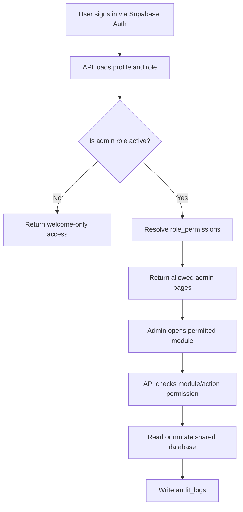
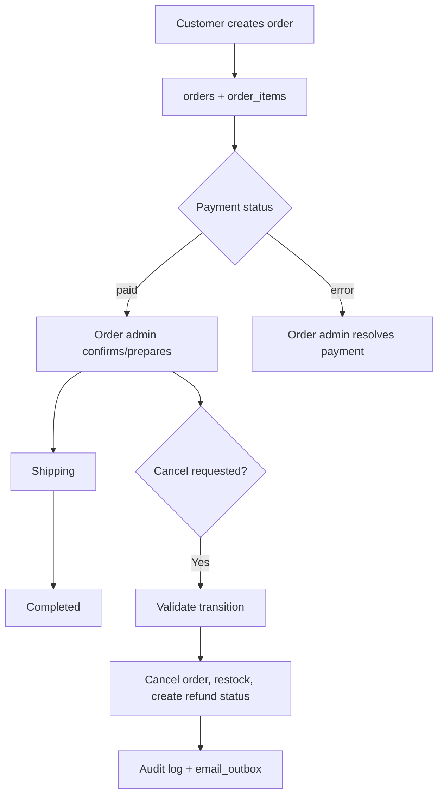
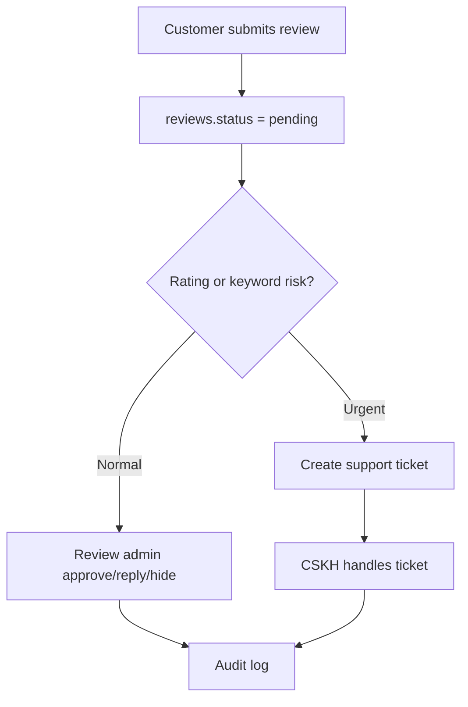
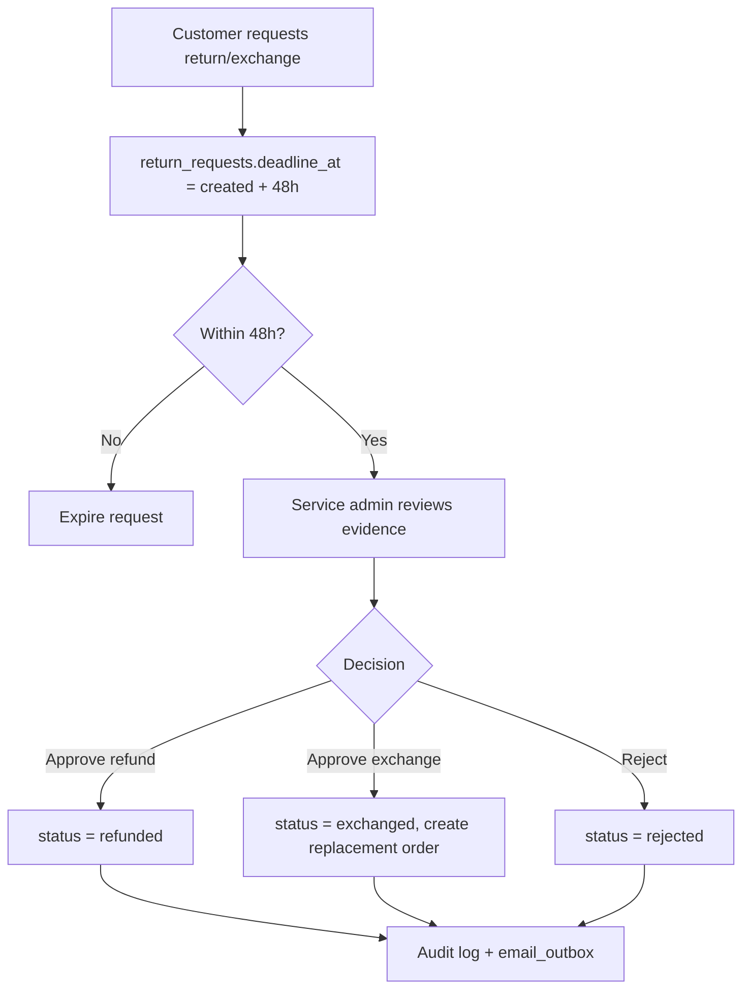
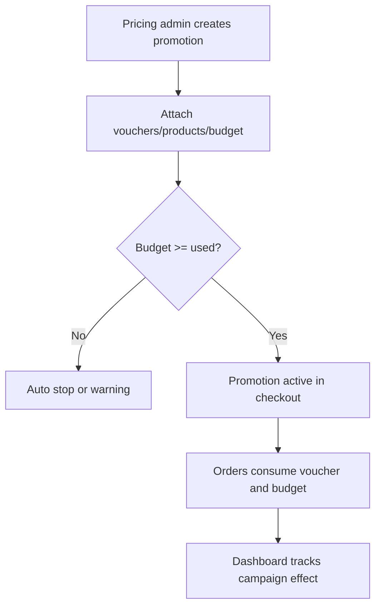

# Velura Admin Backend Process Flow

This document is the business-process source for the admin backend. The current admin UI can keep its static pages while each module is migrated from localStorage to the API/database contract below.

## 1. Account And RBAC Flow

Business rules:

- A new user defaults to `member` and only receives the `welcome` page.
- Admin pages are derived from `app_roles` and `role_permissions`.
- Every admin mutation writes an `audit_logs` row.
- Locking the last active `super_admin` must be blocked in the UI and API extension layer.

## 2. Order Operations Flow

Valid order transitions:

| From | To |
| --- | --- |
| pending | confirmed, held, cancelled |
| confirmed | preparing, held, cancelled |
| preparing | shipping, held |
| shipping | completed, held |
| held | confirmed, preparing, cancelled |
| completed | none |
| cancelled | none |

## 3. Review And CSKH Flow

Rules:

- Reviews rated 1-2 stars should be flagged `urgent` or `negative`.
- A review can be approved, hidden, replied to, or escalated into `support_tickets`.
- Customer-visible replies stay in `reviews.admin_response`.

## 4. Return/Exchange Flow

## 5. Promotion Flow

Rules:

- Voucher codes are globally unique.
- Budget usage is stored in `promotion_budgets.used_amount`.
- When budget reaches limit, promotion status should move to `stopped` or `warning` depending on decision table.
