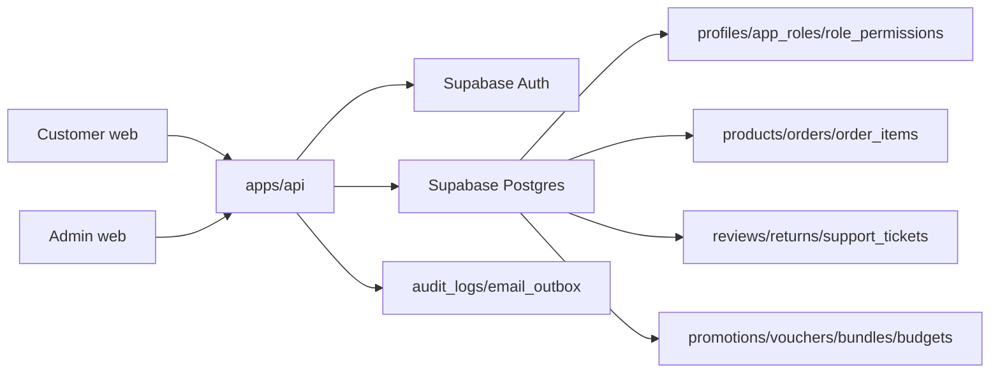

# Velura Admin DFD

Data-flow notes:

- User-web writes customer-owned commerce data.
- Admin-web reads the same rows and mutates workflow fields only through API actions.
- API enforces RBAC before any admin mutation.
- Supabase RLS remains enabled so direct browser access still respects ownership/admin policies.
