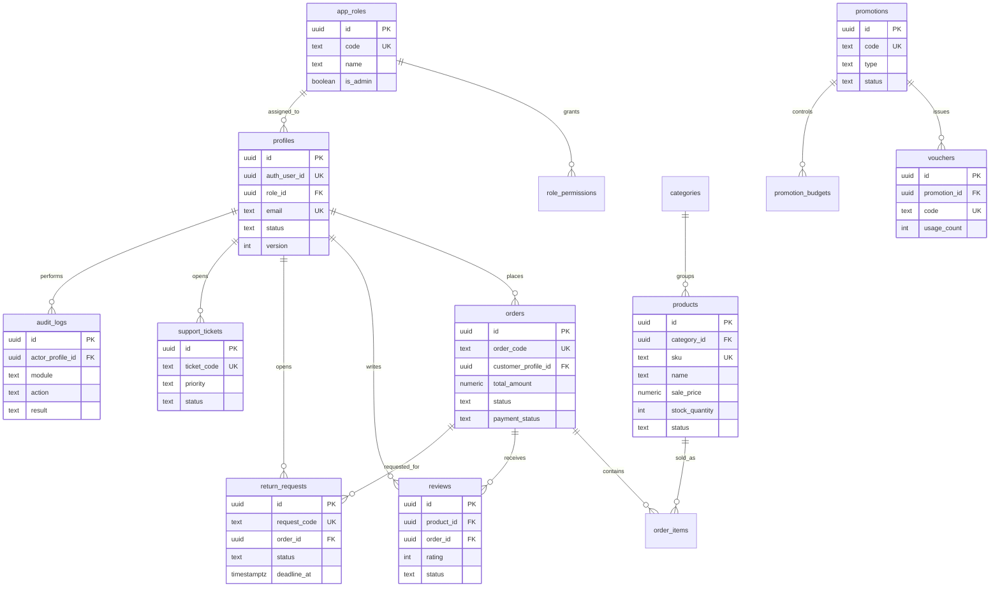

# Velura ERD

```mermaid
erDiagram
  app_roles ||--o{ role_permissions : grants
  app_roles ||--o{ profiles : assigned_to
  profiles ||--o{ orders : places
  profiles ||--o{ reviews : writes
  profiles ||--o{ return_requests : opens
  profiles ||--o{ support_tickets : opens
  categories ||--o{ products : groups
  products ||--o{ order_items : sold_as
  orders ||--o{ order_items : contains
  orders ||--o{ reviews : receives
  orders ||--o{ return_requests : requested_for
  promotions ||--o{ vouchers : issues
  promotions ||--o{ promotion_budgets : controls
  profiles ||--o{ audit_logs : performs

  app_roles {
    uuid id PK
    text code UK
    text name
    boolean is_admin
  }

  profiles {
    uuid id PK
    uuid auth_user_id UK
    uuid role_id FK
    text email UK
    text status
    int version
  }

  products {
    uuid id PK
    uuid category_id FK
    text sku UK
    text name
    numeric sale_price
    int stock_quantity
    text status
  }

  orders {
    uuid id PK
    text order_code UK
    uuid customer_profile_id FK
    numeric total_amount
    text status
    text payment_status
  }

  reviews {
    uuid id PK
    uuid product_id FK
    uuid order_id FK
    int rating
    text status
  }

  return_requests {
    uuid id PK
    text request_code UK
    uuid order_id FK
    text status
    timestamptz deadline_at
  }

  support_tickets {
    uuid id PK
    text ticket_code UK
    text priority
    text status
  }

  promotions {
    uuid id PK
    text code UK
    text type
    text status
  }

  vouchers {
    uuid id PK
    uuid promotion_id FK
    text code UK
    int usage_count
  }

  audit_logs {
    uuid id PK
    uuid actor_profile_id FK
    text module
    text action
    text result
  }
```
