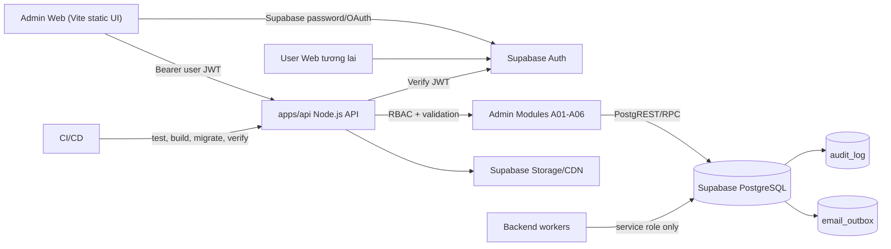
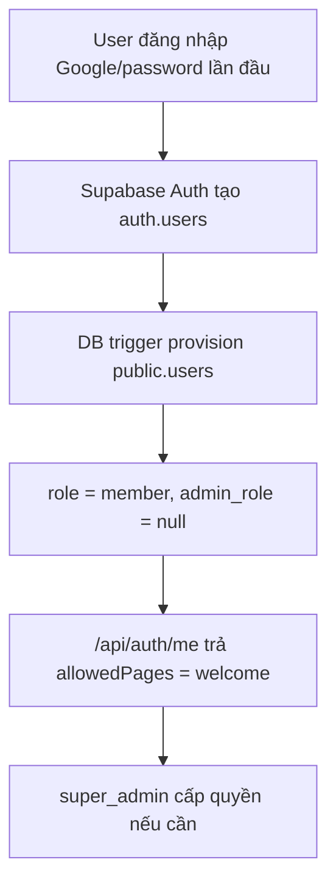
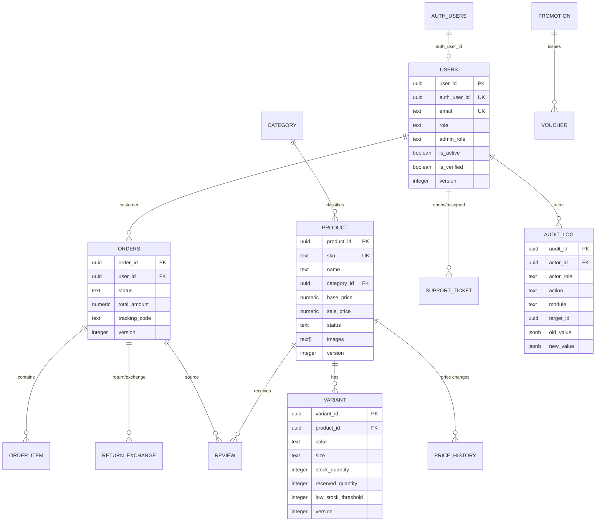
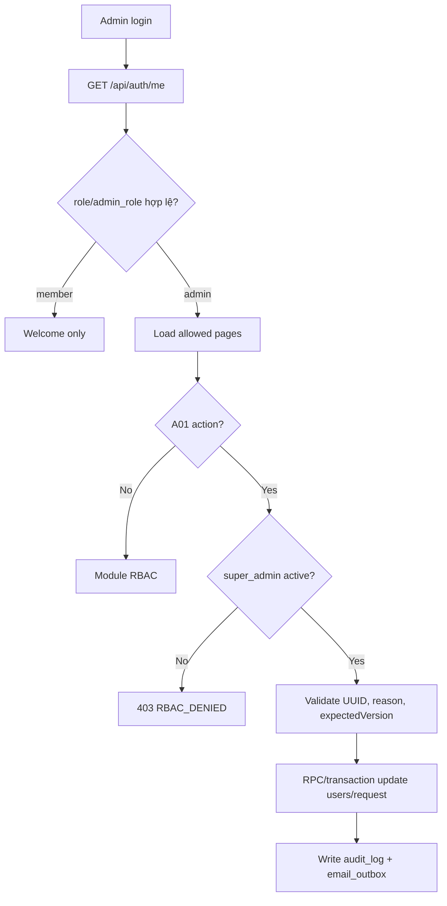
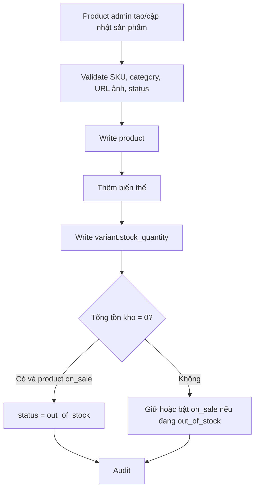
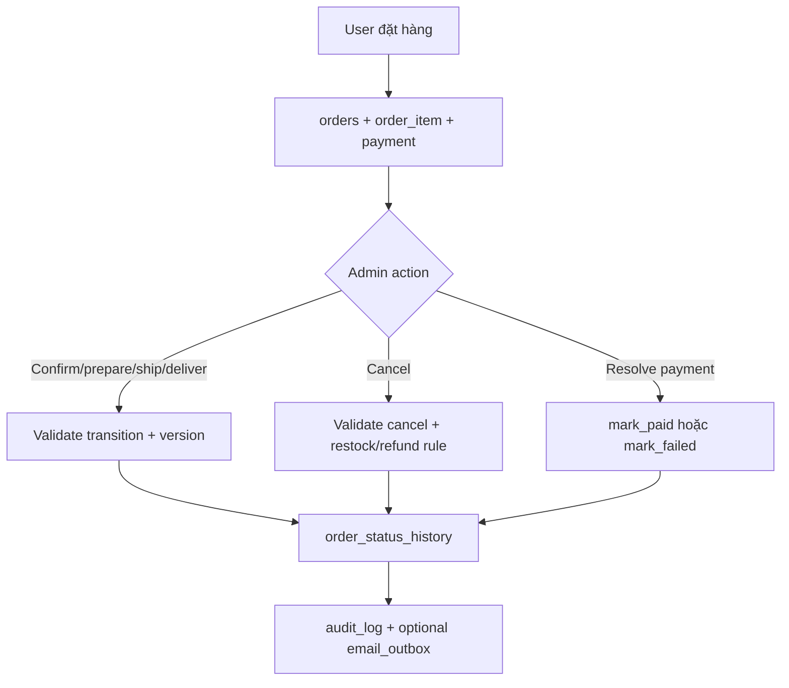

# Velura Admin Backend System Design

**Status:** Production design baseline  
**Updated:** 2026-07-04  
**Scope:** Admin web, shared Node.js API, Supabase Auth, Supabase PostgreSQL, RBAC, A01-A06 admin modules, dashboard, audit logs, production verification.

## 1. Mục tiêu hệ thống

Velura Admin Backend là lớp quản trị production dùng chung dữ liệu với website khách hàng. Admin không dùng mock data, localStorage hay quyền cứng ở frontend để quyết định nghiệp vụ. Toàn bộ thao tác quản trị đi qua API versioned, xác thực bằng Supabase Auth JWT, kiểm tra RBAC ở backend và ghi dữ liệu vào Supabase PostgreSQL.

Mục tiêu thiết kế:

- Dùng Supabase production làm source of truth cho `users`, `product`, `variant`, `category`, `orders`, `order_item`, `review`, `return_exchange`, `support_ticket`, `promotion`, `voucher`, `price_history`, `audit_log`.
- Tách rõ quyền theo vai trò admin: super admin, sản phẩm, đơn hàng, đánh giá, CSKH, giá/khuyến mãi, viewer, member.
- UI admin chỉ hiển thị trang và hành động backend cho phép.
- Mọi mutation quan trọng có validation, optimistic locking qua `expectedVersion`, audit log và kiểm tra dữ liệu thật.
- Thiết kế backend hiện tại là modular monolith để team có thể mở rộng backend user về sau mà không tách service quá sớm.

## 2. Kiến trúc tổng thể



Trách nhiệm chính:

| Thành phần | Trách nhiệm | Không được làm |
| --- | --- | --- |
| Admin web | Login, render UI, gửi JWT, hiển thị loading/empty/error/conflict | Gọi bảng business trực tiếp, chứa service key, tự quyết RBAC |
| Node API | Verify JWT, build auth context, RBAC, validate request, route module, trả error chuẩn | Tin role từ browser, mở generic mutation API, trả secret field |
| Supabase Auth | Quản lý password, OAuth Google, session, JWT | Lưu business role chi tiết |
| Public schema | Lưu profile, RBAC, catalog, order, review, return, promotion, audit | Lưu password raw hoặc token nhạy cảm |
| RPC/RLS | Chặn direct mutation, enforce invariant gần dữ liệu | Bỏ qua version/audit khi mutation |
| Worker | Email outbox, expiry, maintenance | Chạy trong browser hoặc expose secret |

## 3. Chuẩn kết nối production

### Browser/admin web

Browser chỉ dùng publishable key và API base URL.

```text
VELURA_SUPABASE_URL
VELURA_SUPABASE_ANON_KEY
VELURA_API_BASE_URL
```

Luồng:

1. Admin đăng nhập bằng Supabase Auth.
2. Browser nhận Supabase access token.
3. Browser gọi API với `Authorization: Bearer <access_token>`.
4. Browser không đọc/ghi trực tiếp bảng quản trị.

### API/backend

Backend dùng publishable key để verify user token và service key cho tác vụ backend được kiểm soát.

```text
VELURA_SUPABASE_URL
VELURA_SUPABASE_ANON_KEY
VELURA_SUPABASE_SERVICE_ROLE_KEY
CORS_ORIGIN
EMAIL_WEBHOOK_URL
EMAIL_WEBHOOK_TOKEN
```

Quy tắc:

- User-scoped read/mutation ưu tiên caller JWT để RLS biết actor.
- Service role chỉ dùng cho worker hoặc thao tác backend đã qua RBAC.
- Không log `apikey`, `authorization`, cookie, JWT, database URL, webhook token.
- CORS chỉ cấu hình origin thật; local hiện hỗ trợ `http://localhost:5173` và `http://127.0.0.1:5173`.

## 4. RBAC chuẩn

Backend là nguồn quyết định quyền. UI menu chỉ là trình bày.

| `users.role` | `users.admin_role` | Trang được phép |
| --- | --- | --- |
| `member` | `NULL` | `welcome` |
| `admin` | `admin_viewer` | `dashboard` |
| `admin` | `admin_operator_sanpham` | `dashboard`, `products` |
| `admin` | `admin_operator_donhang` | `dashboard`, `orders` |
| `admin` | `admin_operator_gia_km` | `dashboard`, `pricing`, `promotions` |
| `admin` | `admin_operator_danhgia_review` | `dashboard`, `reviews` |
| `admin` | `admin_operator_cskh_dt` | `dashboard`, `returns-cskh` |
| `admin` | `super_admin` | all admin pages |

Module permission:

| Module | Read | Write |
| --- | --- | --- |
| A01 Accounts/RBAC | `super_admin` | `super_admin` |
| A02 Products/Inventory | `super_admin`, `admin_operator_sanpham`, `admin_viewer`, `admin_operator_gia_km` | `super_admin`, `admin_operator_sanpham` |
| A03 Orders | `super_admin`, `admin_operator_donhang`, `admin_operator_cskh_dt` | `super_admin`, `admin_operator_donhang` |
| A04 Reviews | `super_admin`, `admin_operator_danhgia_review` | `super_admin`, `admin_operator_danhgia_review` |
| A05 Returns/CSKH | `super_admin`, `admin_operator_donhang`, `admin_operator_cskh_dt` | `super_admin`, `admin_operator_cskh_dt` |
| A06 Pricing/Promotions | `super_admin`, `admin_operator_gia_km` | `super_admin`, `admin_operator_gia_km` |
| Audit logs | Role-scoped by module | Không sửa từ UI |

New user / Google SSO:



## 5. Data ownership và ERD logic



Nguyên tắc dữ liệu:

- Bảng Supabase production là chuẩn cao nhất; tài liệu BA/BPMN dùng để kiểm tra logic và hành vi.
- Không tạo bảng song song dạng plural nếu canonical đang dùng singular.
- Entity có workflow cần `version`, `updated_at`, audit log.
- Product tồn kho nằm ở `variant.stock_quantity`; product chỉ tổng hợp để hiển thị.
- Giá sản phẩm được hiển thị ở A02 nhưng chỉnh giá thuộc A06.
- Audit log phải đủ actor, role, action, module, target, old/new value, IP.

## 6. API contract chung

Base URL local: `http://localhost:8787`  
Base path admin: `/api/v1/admin`

Error shape:

```json
{
  "error": {
    "code": "VALIDATION_ERROR",
    "message": "Request validation failed",
    "details": {},
    "requestId": "optional",
    "timestamp": "optional"
  }
}
```

Chuẩn API:

- List endpoint có pagination `limit`, `offset`, filter hợp lệ và projection an toàn.
- Path UUID validate trước khi gọi repository.
- Mutation yêu cầu `expectedVersion` khi entity có version.
- `401` cho chưa đăng nhập, `403` cho sai quyền, `409` cho conflict, `422` cho sai nghiệp vụ, `502/503/504` cho lỗi Supabase/service.
- Frontend dùng typed API modules: `account-api.js`, `product-api.js`, `order-api.js`, `review-api.js`, `return-api.js`, `pricing-api.js`, `audit-log-api.js`.

## 7. A01 Accounts và RBAC

### Mục tiêu nghiệp vụ

Super admin quản lý tài khoản user/admin, khóa/mở khóa, cấp role, xử lý yêu cầu nâng quyền và theo dõi audit.

### Bảng chính

- `users`
- `approval_admin_request`
- `audit_log`
- `email_outbox`

### Backend files

- `apps/api/src/accounts/account-router.js`
- `apps/api/src/accounts/account-service.js`
- `apps/api/src/accounts/account-repository.js`
- `apps/api/src/rbac.js`

### UI files

- `src/pages/admin/accounts.html`
- `src/scripts/account-api.js`
- `src/scripts/admin.js`

### Endpoints

| Method | Path | Mục đích |
| --- | --- | --- |
| GET | `/api/auth/me` | Xác minh identity, role, allowed pages |
| GET | `/api/v1/admin/accounts/roles` | Role options chuẩn |
| GET | `/api/v1/admin/accounts` | Danh sách tài khoản |
| GET | `/api/v1/admin/accounts/:id` | Chi tiết tài khoản |
| POST | `/api/v1/admin/accounts/:id/lock` | Khóa tạm thời/vĩnh viễn |
| POST | `/api/v1/admin/accounts/:id/unlock` | Mở khóa |
| POST | `/api/v1/admin/accounts/:id/role` | Đổi role hoặc tạo approval |
| GET | `/api/v1/admin/account-role-requests` | Danh sách yêu cầu nâng quyền |
| POST | `/api/v1/admin/account-role-requests/:id/approve` | Duyệt yêu cầu |
| POST | `/api/v1/admin/account-role-requests/:id/reject` | Từ chối yêu cầu |
| GET | `/api/v1/admin/account-audit-logs` | Audit A01 |

### Luồng nghiệp vụ



### Business rules

- New Auth user mặc định là `member`.
- Chỉ active `super_admin` quản lý tài khoản.
- Không khóa/hạ quyền active super admin cuối cùng.
- Lý do khóa/mở khóa/từ chối phải đủ dài theo BA.
- Mọi mutation cần `expectedVersion`.
- Promotion lên `super_admin` cần quy trình approval riêng nếu bật theo rule.

## 8. A02 Products và Inventory

### Mục tiêu nghiệp vụ

Quản lý sản phẩm, danh mục, ảnh, trạng thái hiển thị, biến thể và tồn kho. Giá hiển thị tại A02 nhưng chỉnh giá qua A06.

### Bảng chính

- `product`
- `variant`
- `category`
- `audit_log`

### Backend files

- `apps/api/src/products/product-router.js`
- `apps/api/src/products/product-service.js`
- `apps/api/src/products/product-repository.js`
- `apps/api/src/products/product-constants.js`

### UI files

- `src/pages/admin/products.html`
- `src/scripts/product-api.js`
- `src/scripts/products.js`

### Endpoints

| Method | Path | Mục đích |
| --- | --- | --- |
| GET | `/api/v1/admin/products` | Danh sách sản phẩm |
| POST | `/api/v1/admin/products` | Tạo sản phẩm |
| GET | `/api/v1/admin/products/:id` | Chi tiết sản phẩm |
| PATCH | `/api/v1/admin/products/:id` | Cập nhật thông tin phi giá |
| GET | `/api/v1/admin/products/categories` | Danh mục |
| GET | `/api/v1/admin/products/low-stock` | Tồn kho thấp |
| GET | `/api/v1/admin/products/:id/variants` | Biến thể sản phẩm |
| POST | `/api/v1/admin/products/:id/variants` | Tạo biến thể/tồn kho ban đầu |
| POST | `/api/v1/admin/products/:id/update-stock` | Điều chỉnh tồn kho variant |
| POST | `/api/v1/admin/products/:id/change-status` | Đổi trạng thái sản phẩm |
| POST | `/api/v1/admin/products/import-csv` | Preview CSV |
| POST | `/api/v1/admin/products/import-csv/commit` | Import CSV production |

### Status

| Status | Ý nghĩa | Transition |
| --- | --- | --- |
| `on_sale` | Đang bán | `hidden`, `out_of_stock`, `discontinued` |
| `hidden` | Tạm ẩn | `on_sale`, `discontinued` |
| `out_of_stock` | Hết hàng | `on_sale`, `hidden`, `discontinued` |
| `discontinued` | Ngừng kinh doanh | `hidden` |

### Luồng sản phẩm và tồn kho



### Business rules

- Không chỉnh giá qua PATCH product; dùng A06 pricing.
- Tồn kho chỉ điều chỉnh theo variant.
- Product có tổng tồn kho 0 và đang `on_sale` phải chuyển `out_of_stock`.
- Product `hidden` không tự bật bán khi thêm variant.
- CSV tối đa 500 dòng, 60 KB ở UI, bắt buộc `sku`, `name`, `base_price`, `category_id`.
- CSV import thật phải gọi `/import-csv/commit`.
- Ảnh sản phẩm dùng HTTPS URL từ Supabase Storage/CDN hoặc kho ảnh production.

## 9. A03 Orders và Payments

### Mục tiêu nghiệp vụ

Quản lý đơn hàng, trạng thái giao hàng, xử lý hủy đơn và ngoại lệ thanh toán.

### Bảng chính

- `orders`
- `order_item`
- `payment`
- `order_status_history`
- `audit_log`
- `email_outbox`

### Backend files

- `apps/api/src/orders/order-router.js`
- `apps/api/src/orders/order-service.js`
- `apps/api/src/orders/order-repository.js`
- `apps/api/src/orders/order-constants.js`

### UI files

- `src/pages/admin/orders.html`
- `src/scripts/order-api.js`
- `src/scripts/orders.js`

### Endpoints

| Method | Path | Mục đích |
| --- | --- | --- |
| GET | `/api/v1/admin/orders` | Danh sách đơn |
| GET | `/api/v1/admin/orders/:id` | Chi tiết đơn, item, payment, history |
| POST | `/api/v1/admin/orders/:id/change-status` | Đổi trạng thái |
| POST | `/api/v1/admin/orders/:id/cancel` | Hủy đơn |
| POST | `/api/v1/admin/orders/:id/payments/:paymentId/resolve` | Xử lý thanh toán lỗi |
| GET | `/api/v1/admin/orders/:id/audit-logs` | Audit đơn |

### Status

| From | To |
| --- | --- |
| `pending` | `confirmed`, `cancelled` |
| `confirmed` | `preparing`, `cancelled` |
| `preparing` | `shipping`, `cancelled` |
| `shipping` | `delivered`, `failed_delivery` |
| `failed_delivery` | `shipping`, `cancelled` |
| `delivered` | `completed` |
| `cancelled` | none |
| `completed` | none |

### Luồng đơn hàng



### Business rules

- `shipping` cần tracking code.
- Cancel phải xét payment để refund hoặc không refund.
- CSKH có thể đọc đơn để hỗ trợ nhưng không có quyền đổi trạng thái.
- Không lưu raw card data.
- Mọi mutation có `expectedVersion`.

## 10. A04 Reviews

### Mục tiêu nghiệp vụ

Duyệt đánh giá sản phẩm, phản hồi, ẩn/từ chối đánh giá không phù hợp và chuyển vấn đề nghiêm trọng sang CSKH.

### Bảng chính

- `review`
- `product`
- `orders`
- `support_ticket`
- `audit_log`

### Backend files

- `apps/api/src/reviews/review-router.js`
- `apps/api/src/reviews/review-service.js`
- `apps/api/src/reviews/review-repository.js`
- `apps/api/src/reviews/review-constants.js`

### UI files

- `src/pages/admin/reviews.html`
- `src/scripts/review-api.js`
- `src/scripts/reviews.js`

### Endpoints

| Method | Path | Mục đích |
| --- | --- | --- |
| GET | `/api/v1/admin/reviews` | Danh sách review |
| GET | `/api/v1/admin/reviews/:id` | Chi tiết review |
| POST | `/api/v1/admin/reviews/:id/approve` | Duyệt review |
| POST | `/api/v1/admin/reviews/:id/reject` | Từ chối/ẩn review |
| POST | `/api/v1/admin/reviews/:id/reply` | Admin reply |
| GET | `/api/v1/admin/reviews/audit-logs` | Audit review |

### Status

| From | To |
| --- | --- |
| `pending` | `approved`, `rejected` |
| `approved` | `rejected` |
| `rejected` | `approved` |

### Business rules

- Review 1-2 sao hoặc có keyword rủi ro nên flag urgent.
- Reject/hide cần lý do.
- Reply phải escape khi render ra UI.
- Review phải liên kết product/order hợp lệ theo dữ liệu thật.
- Nếu escalated sang CSKH, tạo `support_ticket` và audit trong cùng transaction hoặc transaction bù có outbox.

## 11. A05 Returns, Exchanges và CSKH

### Mục tiêu nghiệp vụ

Quản lý đổi trả, hoàn tiền, đổi hàng và ticket chăm sóc khách hàng.

### Bảng chính

- `return_exchange`
- `support_ticket`
- `orders`
- `payment`
- `audit_log`
- `email_outbox`

### Backend files

- `apps/api/src/returns/return-router.js`
- `apps/api/src/returns/return-service.js`
- `apps/api/src/returns/return-repository.js`
- `apps/api/src/returns/return-constants.js`

### UI files

- `src/pages/admin/returns-cskh.html`
- `src/scripts/return-api.js`
- `src/scripts/returns-cskh.js`

### Endpoints

| Method | Path | Mục đích |
| --- | --- | --- |
| GET | `/api/v1/admin/returns` | Danh sách yêu cầu đổi trả |
| GET | `/api/v1/admin/returns/:id` | Chi tiết yêu cầu |
| POST | `/api/v1/admin/returns/:id/approve-refund` | Duyệt hoàn tiền |
| POST | `/api/v1/admin/returns/:id/approve-exchange` | Duyệt đổi hàng |
| POST | `/api/v1/admin/returns/:id/reject` | Từ chối |
| GET | `/api/v1/admin/support-tickets` | Danh sách ticket |
| GET | `/api/v1/admin/support-tickets/:id` | Chi tiết ticket |
| POST | `/api/v1/admin/support-tickets/:id/assign` | Gán nhân viên |
| POST | `/api/v1/admin/support-tickets/:id/respond` | Phản hồi |
| POST | `/api/v1/admin/support-tickets/:id/close` | Đóng ticket |
| GET | `/api/v1/admin/service-audit-logs` | Audit A05 |

### Return status

| From | To |
| --- | --- |
| `pending` | `approved`, `rejected` |
| `approved` | `shipping_back` |
| `shipping_back` | `received` |
| `received` | `completed` |
| `completed` | none |
| `rejected` | none |

### Support ticket status

| From | To |
| --- | --- |
| `open` | `processing`, `closed` |
| `processing` | `resolved`, `closed` |
| `resolved` | `closed` |
| `closed` | none |

### Business rules

- Deadline đổi trả dùng database time, không tin browser time.
- Approve refund cần amount > 0 và version.
- Reject cần reason.
- Evidence file cần bucket/policy riêng nếu có upload private evidence.
- Exchange tạo replacement order hoặc outbox/saga an toàn.
- A05 hiện đã đọc được qua `super_admin`; tài khoản test `cskh@velura.vn` cần repair Auth nếu dùng để test trực tiếp.

## 12. A06 Pricing, Promotions và Vouchers

### Mục tiêu nghiệp vụ

Quản lý lịch sử giá, thay đổi giá, chương trình khuyến mãi và voucher. Đây là module duy nhất được đổi giá sản phẩm.

### Bảng chính

- `price_history`
- `product`
- `variant`
- `promotion`
- `voucher`
- `audit_log`

### Backend files

- `apps/api/src/pricing/pricing-router.js`
- `apps/api/src/pricing/pricing-service.js`
- `apps/api/src/pricing/pricing-repository.js`
- `apps/api/src/pricing/pricing-constants.js`

### UI files

- `src/pages/admin/pricing.html`
- `src/pages/admin/promotions.html`
- `src/scripts/pricing-api.js`
- `src/scripts/pricing.js`
- `src/scripts/promotions.js`

### Endpoints

| Method | Path | Mục đích |
| --- | --- | --- |
| GET | `/api/v1/admin/pricing/history` | Lịch sử giá |
| POST | `/api/v1/admin/products/:id/change-price` | Đổi giá sản phẩm |
| GET | `/api/v1/admin/promotions` | Danh sách promotion |
| GET | `/api/v1/admin/promotions/:id` | Chi tiết promotion |
| POST | `/api/v1/admin/promotions` | Tạo promotion |
| PATCH | `/api/v1/admin/promotions/:id` | Cập nhật promotion |
| POST | `/api/v1/admin/promotions/:id/activate` | Bật promotion |
| POST | `/api/v1/admin/promotions/:id/pause` | Tạm dừng promotion |
| GET | `/api/v1/admin/vouchers` | Danh sách voucher |
| GET | `/api/v1/admin/vouchers/:id` | Chi tiết voucher |
| POST | `/api/v1/admin/vouchers` | Tạo voucher |
| PATCH | `/api/v1/admin/vouchers/:id` | Cập nhật voucher |
| GET | `/api/v1/admin/pricing/audit-logs` | Audit A06 |

### Types

Promotion types:

- `flash_sale`
- `combo_discount`
- `product_discount`
- `bulk_discount`
- `seasonal_sale`

Voucher types:

- `fixed_amount`
- `percentage`
- `free_shipping`

### Business rules

- A02 không được đổi giá; A06 đổi giá và ghi `price_history`.
- Price mutation cần reason, new price hợp lệ và `expectedVersion`.
- Voucher code unique.
- Promotion phải có start/end date hợp lệ.
- Budget, used count và voucher redemption phải chống overspend bằng row lock/idempotency ở DB.
- `admin_operator_sanpham` không được đọc/ghi A06.

## 13. Dashboard và Audit Logs

Dashboard đọc aggregate từ canonical tables:

- `product`
- `variant`
- `review`
- `return_exchange`
- `support_ticket`
- `promotion`

Audit logs đọc từ `audit_log` theo module và role. Không expose token, password, OTP, raw webhook, raw payment data.

Yêu cầu:

- Dashboard không dùng mock card cứng.
- Logs có pagination và filter.
- Các aggregate nặng cần index hoặc materialized view sau khi có query plan staging.

## 14. UI synchronization rules

UI admin phải đồng bộ đúng backend:

| UI page | API module | Quy tắc |
| --- | --- | --- |
| `login.html` | Supabase Auth + `/api/auth/me` | Không báo sai password nếu lỗi backend verification |
| `welcome.html` | `/api/auth/me` | Member/new SSO chỉ thấy welcome |
| `accounts.html` | `account-api.js` | Chỉ super admin thấy A01 |
| `products.html` | `product-api.js` | Giá bị khóa khi update; tồn kho qua variant; ảnh qua URL production |
| `orders.html` | `order-api.js` | Status action theo transition |
| `reviews.html` | `review-api.js` | Escape comment/reply |
| `returns-cskh.html` | `return-api.js` | Return và support ticket cùng module CSKH |
| `pricing.html`, `promotions.html` | `pricing-api.js` | Chỉ pricing operator/super admin |
| `logs.html` | `audit-log-api.js` | Role-scoped logs |

Không được có:

- `src/scripts/db.js` fallback cho dữ liệu admin production.
- Button hiển thị mà backend không có endpoint tương ứng.
- Local role override.
- Mock hardcode trong UI quản trị production.

## 15. Production verification hiện tại

Kết quả verify gần nhất ngày 2026-07-04:

| Kiểm tra | Kết quả |
| --- | --- |
| `npm run check:js` | Pass |
| `npm run test:api` | Pass, 90/90 |
| `npm run build` | Pass |
| A01-A06 live module smoke | Pass, 16/16 |
| `npm run verify:a01:supabase` | Pass |
| `npm run verify:a02:supabase` | Pass |
| `npm run verify:a03:supabase` | Pass |
| A02 UI browser smoke | Pass |
| CSV import A02 production | Pass, created `VL-A021` - `VL-A025` as `hidden` |
| Variant create A02 | Pass, `VL-A021` variant `Den/M` stock `12` |
| Stock status sync | Pass, 39 `on_sale` products with zero variant stock moved to `out_of_stock` |

Known issue:

- `cskh@velura.vn` và `viewer@velura.vn` test accounts đang lỗi Supabase Auth schema khi login/create. Backend A05 vẫn pass bằng `super_admin`; cần repair Auth users nếu muốn dùng hai tài khoản test này.

## 16. Test strategy chuẩn

### Role matrix bắt buộc

Mỗi module cần test:

- unauthenticated
- `member`
- inactive admin
- `admin_viewer`
- correct operator
- unrelated operator
- `super_admin`

### Test layers

| Layer | Nội dung |
| --- | --- |
| Unit | validators, transition tables, reason/version rules |
| Router | route matching, status code, JSON body, request size |
| Service | RBAC, validation before repository, conflict handling |
| Repository | projection, Supabase filter, RPC params |
| Integration | real Supabase staging, RLS, RPC, audit |
| E2E UI | login, allowed pages, forms, popup, conflict, empty/error |
| Security | XSS escape, IDOR, secret scan, direct table mutation denial |

Production mutation tests chỉ chạy với synthetic data được duyệt. Mutation test đầy đủ phải chạy ở staging.

## 17. Deployment và CI/CD

Deployment order:

```text
database expand -> API deploy -> admin web deploy -> feature enablement -> observe -> cleanup
```

CI gate:

```text
npm ci
npm run check:js
npm run test:api
npm run build
npm run smoke:api
verify Supabase schema/RLS per module
browser E2E by role on staging
secret/dependency scan
```

Production release gate:

- Staging green cùng commit SHA.
- Backup/PITR Supabase đã xác nhận.
- Migration rollback/forward-fix plan có sẵn.
- Secrets nằm trong environment secret store, không nằm trong Git.
- Read-only production smoke pass sau deploy.
- Theo dõi logs/latency/RBAC denied ít nhất 30 phút sau bật module.

## 18. Security và operations

Security controls:

- MFA cho `super_admin` và người approve deploy production.
- Exact CORS origins.
- CSP, HSTS, frame deny, MIME sniff protection.
- Service role không bao giờ đi vào browser.
- Direct mutation grants cho `anon/authenticated` phải bị revoke trên bảng admin-controlled.
- Audit role change, lock/unlock, price change, order status, refund, promotion activation.

Observability:

- Structured logs: route, request id, actor id, role, status, duration.
- Không log PII payload hoặc token.
- Metrics: p95 latency, 4xx/5xx rate, Supabase latency, worker queue, RBAC denied count.
- Business alerts: stock underflow, voucher overspend, duplicate financial action, failed order transition.

Rollback:

- Web/API: redeploy previous SHA and disable feature flag.
- DB: prefer forward-fix; destructive rollback only after incident approval.
- Data corruption: Supabase PITR restore into separate project first, then controlled recovery.

## 19. Definition of Done cho từng module

Một module admin backend chỉ được xem là hoàn thiện khi:

- BA process/use case/decision table rõ.
- ERD và field map khớp Supabase production.
- API có router/service/repository riêng, không dùng generic unsafe mutation.
- RBAC đúng ở UI, API và DB.
- Mutation có validation, `expectedVersion`, audit log.
- UI load dữ liệu thật qua API, không mock/hardcode.
- Button nào có trên UI đều có backend thật.
- Empty/loading/error/conflict states hoạt động.
- Unit/API/security/E2E/staging integration pass.
- Production smoke/read-only verify pass.
- Monitoring, rollback và known limitations được ghi lại.

## 20. Next implementation focus

1. Repair Supabase Auth test accounts `cskh@velura.vn` và `viewer@velura.vn`.
2. Chuẩn hóa A04-A06 mutation E2E trên staging trước khi chạy production mutation sâu.
3. Hoàn thiện OpenAPI spec cho `/api/v1/admin/*`.
4. Bổ sung Storage policy/upload flow cho product images thay vì chỉ nhập URL.
5. Bổ sung dashboard aggregate endpoint có pagination/cache/index rõ.
6. Tạo GitHub Actions staging/production gate theo đúng test matrix.
