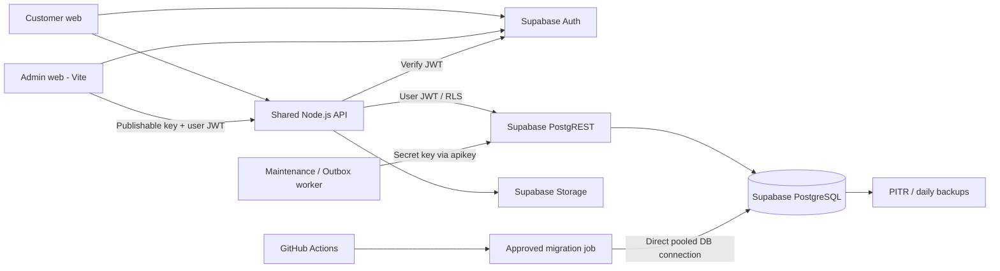

# Velura Admin Production Plan With Supabase

**Status:** Execution baseline  
**Updated:** 2026-07-02  
**Scope:** Admin web, shared Node.js API, Supabase Auth/PostgreSQL/Storage, CI/CD, staging and production operations.

## 1. Objectives

1. Replace all admin `db.js`/localStorage business data with typed `/api/v1/admin/*` APIs.
2. Use the canonical singular Supabase tables as the source of truth.
3. Enforce RBAC twice: API authorization and PostgreSQL RLS/security-definer RPCs.
4. Deploy database, API and admin web through reviewed CI/CD pipelines.
5. Preserve a shared database contract for the future customer backend.
6. Release one module at a time only after staging and production gates pass.

## 2. Current State

| Module | Current source state | Supabase production state | Release decision |
| --- | --- | --- | --- |
| A01 Accounts/RBAC | API, UI, migration and automated tests complete | Required columns/tables resolve | Run authenticated RPC/RLS tests before final sign-off |
| A02 Products/Inventory | API, UI, migration and automated tests complete | Schema/RLS read verifier passes | Authenticated RPC/RBAC sign-off pending |
| A03 Orders | Migration/API/UI/unit/security tests complete; no `db.js` dependency | Migrations `003`/`004`, RLS, RPC exposure and DB role matrix verified | JWT/E2E mutation sign-off pending |
| A04 Reviews | UI still uses `db.js` | Not verified | Not production-ready |
| A05 Returns/CSKH | UI still uses `db.js` | Not verified | Not production-ready |
| A06 Pricing/Promotions | UI still uses `db.js` | Not verified | Not production-ready |
| Dashboard/Audit | Mixed static/legacy reads | Partially available | Replace with typed read endpoints |

The generic `/api/admin/*` mutation layer remains disabled. Each module must have an explicit versioned router, service, repository and migration.

## 3. Target Architecture



### Component responsibilities

| Component | Responsibilities | Must not do |
| --- | --- | --- |
| Admin web | Forms, loading/error states, output encoding, JWT forwarding | Read/write business tables directly; contain secret keys |
| Shared API | JWT verification, RBAC, validation, rate limiting, stable response contracts | Trust browser roles; execute arbitrary table/resource requests |
| PostgreSQL | RLS, atomic transactions, optimistic locking, invariants, audit/outbox | Store Supabase Auth passwords in public tables |
| Worker | Approval expiry, email outbox claim/retry, scheduled maintenance | Run in browser; expose secret key in logs |
| CI/CD | Test, scan, migrate, deploy, verify, rollback | Deploy production without environment approval |

## 4. Architecture Decisions

| Decision | Rationale | Trade-off |
| --- | --- | --- |
| Modular monolith API | Current team and codebase need shared contracts and simple operations | Modules must maintain strict boundaries |
| Supabase Auth + PostgreSQL | Shared identity, ACID workflows, RLS and managed backups | Strong dependency on correct policies and migrations |
| User JWT for admin data operations | PostgreSQL can independently enforce the acting user's role | Every request must propagate a valid short-lived JWT |
| Secret key only for backend workers | Allows scheduled privileged tasks without exposing credentials | Worker paths need additional tests and monitoring |
| Versioned typed APIs | Prevents schema leakage and generic unsafe mutations | More implementation work per module |
| Expand/migrate/contract database releases | Supports zero-downtime API/web rollouts | Destructive cleanup happens in a later release |
| Separate staging Supabase project | Prevents testing from modifying customer production data | Additional project and secret-management cost |

## 5. Environments

| Environment | Git branch | Supabase project | Data | Deployment |
| --- | --- | --- | --- | --- |
| Local | feature branches | local Supabase or dedicated dev project | Generated fixtures | Developer machine |
| Staging | `develop` | Separate staging project | Sanitized deterministic fixtures | Automatic after CI |
| Production | `main`/release tag | `drvkrpoojyncodfytftn` | Real data | Manual GitHub Environment approval |

Never use the production project for automated mutation tests. Staging IDs and secrets must differ from production.

## 6. Supabase Connection Standard

### Browser variables

```text
VELURA_SUPABASE_URL
VELURA_SUPABASE_ANON_KEY       # sb_publishable_*, safe for browser
VELURA_API_BASE_URL
```

The browser sends the publishable key to Supabase Auth and sends the signed user JWT to the Velura API. It never receives `sb_secret_*`, database passwords or management tokens.

### API and worker secrets

```text
VELURA_SUPABASE_URL
VELURA_SUPABASE_ANON_KEY
VELURA_SUPABASE_SERVICE_ROLE_KEY   # sb_secret_*, backend only
EMAIL_WEBHOOK_URL
EMAIL_WEBHOOK_TOKEN
CORS_ORIGIN
```

- User-scoped PostgREST calls: `apikey = publishable key`, `Authorization = Bearer <user JWT>`.
- Backend secret-key calls: `apikey = secret key`; do not treat an opaque `sb_secret_*` value as a JWT.
- Redact `authorization`, `apikey`, cookies, database URLs and webhook tokens from logs.

### Migration identity

```text
SUPABASE_DB_URL              # pooled/direct PostgreSQL URI, migration job only
SUPABASE_ACCESS_TOKEN        # optional Supabase CLI/Management API identity
```

The migration identity is stored in the staging/production secret manager or GitHub Environment secret. It is never committed, passed as a command argument, or pasted into chat.

### Immediate credential action

Rotate the previously exposed Management token, secret key and PostgreSQL password before the next deployment. Revoke old values after staging and production are updated.

## 7. Database Delivery Standard

### Canonical contract

- Use singular BA tables: `users`, `product`, `variant`, `category`, `orders`, `order_item`, `review`, `return_exchange`, `support_ticket`, `promotion`, `voucher`, `audit_log`.
- Do not create parallel plural tables.
- Supabase Auth owns password credentials; `public.users` owns profile and RBAC state.
- UUID is required for entity identifiers.
- Mutable workflow entities require `version` and `updated_at`.

### Migration rules

1. Number migrations monotonically under `database/migrations/`.
2. Migration must be transactional unless PostgreSQL disallows the operation.
3. Additive schema/RPC/RLS changes deploy before API code that uses them.
4. Never mix production user promotion or mock seeding into a schema migration.
5. Direct browser mutations are revoked; business mutations use reviewed RPCs.
6. Every RPC repeats authentication, active-account, RBAC, version and domain checks.
7. Every successful admin mutation writes `audit_log` in the same transaction.
8. Notification-required transactions enqueue `email_outbox` atomically.
9. Add indexes from observed query patterns and validate with `EXPLAIN (ANALYZE, BUFFERS)` in staging.
10. Run `ANALYZE` after large backfills; do not disable autovacuum.

### Migration order

| Order | Migration | Gate |
| --- | --- | --- |
| 001 | `001_uc_a01_account_rbac.sql` | A01 schema verifier and authenticated A01 tests pass |
| 002 | `002_uc_a02_products_inventory.sql` | A02 verifier, catalog RLS and product RPC tests pass |
| 003 | Orders/payment/status workflow | A03 tests and order transition matrix pass |
| 004 | A03 order-reader RBAC correction | Viewer denied; CSKH remains read-only |
| 005 | Reviews/moderation | A04 tests and ownership/moderation RLS pass |
| 006 | Returns/CSKH | A05 deadline/refund/exchange tests pass |
| 007 | Pricing/promotions | A06 budget/voucher/concurrency tests pass |
| 008 | Dashboard read models/audit retention | Performance and observability gates pass |

## 8. Module Execution Plan

### A01 Accounts and RBAC

**Tables:** `users`, `approval_admin_request`, `audit_log`, `email_outbox`  
**Role:** active `super_admin` only for account management.

- Verify `/api/auth/me` for member, inactive account and every admin role.
- Verify list/detail, temporary/permanent lock, unlock and non-super role assignment.
- Verify last-super-admin protection under concurrent requests.
- Verify super-admin approval separation: requester, target and approver are distinct.
- Verify request expiry, outbox retry and audit records.
- Add MFA requirement for `super_admin` before general availability.

### A02 Products and inventory

**Tables:** `product`, `variant`, `category`, `audit_log`  
**Read roles:** `admin_viewer`, product operator, super admin.  
**Write roles:** product operator, super admin.

- Rotate secrets and deploy migration `002` to staging.
- Verify public users see only saleable products and associated variants/categories.
- Verify admins see hidden/out-of-stock/discontinued products according to role.
- Verify create/update, duplicate SKU/slug, status transitions and stale versions.
- Verify stock delta, stock underflow, low-stock query and product audit module.
- Verify CSV preview never writes rows; implement a separate atomic commit endpoint before enabling bulk import.
- Deploy to production only after `npm run verify:a02:supabase` passes.

### A03 Orders and payment operations

**Tables:** `orders`, `order_item`, `order_status_history`, `payment`, `audit_log`, `email_outbox`  
**Role:** order operator and super admin; CSKH receives explicitly limited support actions.

Required versioned endpoints:

```text
GET  /api/v1/admin/orders
GET  /api/v1/admin/orders/:id
GET  /api/v1/admin/orders/:id               # includes status history and payments
GET  /api/v1/admin/orders/:id/audit-logs
POST /api/v1/admin/orders/:id/change-status
POST /api/v1/admin/orders/:id/cancel
POST /api/v1/admin/orders/:id/payments/:paymentId/resolve
```

Database transaction requirements:

- Lock order row and require `expectedVersion`.
- Validate the BPMN status transition matrix in PostgreSQL.
- Cancellation updates status history, releases/resets inventory and enqueues notification atomically.
- Payment resolution never stores raw card data.
- Prevent duplicate transitions with idempotency keys.
- `src/scripts/orders.js` now uses only the versioned order API; verify the real JWT/RLS flow in staging before release.

### A04 Reviews and moderation

**Tables:** `review`, `product`, `orders`, `support_ticket`, `audit_log`  
**Role:** review operator and super admin.

```text
GET  /api/v1/admin/reviews
GET  /api/v1/admin/reviews/:id
POST /api/v1/admin/reviews/:id/approve
POST /api/v1/admin/reviews/:id/hide
POST /api/v1/admin/reviews/:id/reply
POST /api/v1/admin/reviews/:id/escalate
```

- Require reason for hide/escalate.
- Escape review content and admin replies in every UI surface.
- Validate that a customer review references an eligible purchased product/order.
- Escalation creates a support ticket and audit entry atomically.
- Replace `src/scripts/reviews.js` local data only after API/RLS tests pass.

### A05 Returns, exchanges and CSKH

**Tables:** `return_exchange`, `return_item`, `support_ticket`, `orders`, `payment`, `audit_log`, `email_outbox`  
**Role:** CSKH operator and super admin.

```text
GET  /api/v1/admin/returns
GET  /api/v1/admin/returns/:id
POST /api/v1/admin/returns/:id/approve-refund
POST /api/v1/admin/returns/:id/approve-exchange
POST /api/v1/admin/returns/:id/reject
GET  /api/v1/admin/support-tickets
POST /api/v1/admin/support-tickets/:id/assign
POST /api/v1/admin/support-tickets/:id/respond
POST /api/v1/admin/support-tickets/:id/close
```

- Enforce the documented deadline in PostgreSQL, not browser time.
- Refund/exchange decisions require reason, evidence metadata and optimistic version.
- Exchange creates the replacement order in the same transaction or uses a recoverable saga/outbox step.
- Restrict evidence files to validated Storage buckets, MIME types and size limits.
- Replace `src/scripts/returns-cskh.js` local data after integration tests pass.

### A06 Pricing, vouchers and promotions

**Tables:** `price_history`, `promotion`, `voucher`, `promotion_product`, `product`, `audit_log`  
**Role:** pricing/promotion operator and super admin.

```text
GET  /api/v1/admin/pricing/history
POST /api/v1/admin/products/:id/change-price
GET/POST/PATCH /api/v1/admin/promotions
POST /api/v1/admin/promotions/:id/activate
POST /api/v1/admin/promotions/:id/stop
GET/POST/PATCH /api/v1/admin/vouchers
```

- Price changes preserve immutable history and require `expectedVersion` plus reason.
- Validate promotion windows, product overlap, voucher uniqueness, usage limits and budget constraints.
- Voucher redemption uses row locks/idempotency to prevent overspend.
- Start/stop jobs use database time and are safe to rerun.
- Replace `pricing.js` and `promotions.js` local data after staging validation.

### Dashboard and audit logs

- Add `/api/v1/admin/dashboard` with role-scoped aggregate projections.
- Add `/api/v1/admin/audit-logs` with safe filtering, pagination and retention policy.
- Never expose secret fields, full tokens or unrestricted `select=*`.
- Use materialized views only after query plans show a need; refresh concurrently where supported.
- Replace static dashboard/log data last, after business modules provide reliable source data.

## 9. Shared API Standards

- Base path: `/api/v1/admin`.
- Error shape: `{ error: { code, message, details, requestId, timestamp } }`.
- Lists return rows plus total count and bounded pagination.
- Maximum page size: 100 unless a module documents a lower limit.
- Mutation bodies are bounded and schema validated.
- UUID path parameters are validated before repository access.
- All mutable requests require `expectedVersion`.
- Use `409` for version/idempotency conflicts and `422` for domain validation.
- Apply per-actor mutation rate limiting; use a shared Redis limiter when API replicas exceed one.
- Add OpenAPI generation before external consumers depend on the API.

## 10. CI/CD Pipeline

### Pull request CI

```text
npm ci
secret scan
npm run check:js
npm run test:api
npm run build
npm run smoke:api
migration lint/static security tests
dependency and container vulnerability scan
```

PR merge is blocked when any gate fails. Tests do not call production Supabase.

### Staging deployment

1. Build immutable admin/API artifacts tagged with Git SHA.
2. Back up staging and apply pending migrations.
3. Run schema verifiers and authenticated module tests.
4. Deploy API.
5. Verify `/health`, authorization denial and module smoke paths.
6. Deploy admin web.
7. Run browser E2E by role.
8. Record test evidence on the release candidate.

### Production deployment

1. Create release tag from a green staging SHA.
2. Require GitHub `production` environment approval.
3. Confirm backup/PITR health and migration rollback plan.
4. Apply backward-compatible database migration.
5. Run read-only schema/RLS verification.
6. Deploy API using rolling or blue-green strategy.
7. Run health, auth and read-only smoke tests.
8. Deploy admin web.
9. Enable the module feature flag for internal admins first.
10. Observe errors/latency for at least 30 minutes before full enablement.

Deployment order is always **database expand -> API -> web -> feature enablement**.

## 11. GitHub Environments And Secrets

Create `staging` and `production` GitHub Environments with required reviewers.

| Secret | Staging | Production | Consumer |
| --- | --- | --- | --- |
| `SUPABASE_URL` | staging URL | production URL | API/web build |
| `SUPABASE_PUBLISHABLE_KEY` | staging key | production key | admin web/API |
| `SUPABASE_SECRET_KEY` | staging secret | production secret | API worker only |
| `SUPABASE_DB_URL` | staging pooler | production pooler | migration job only |
| `EMAIL_WEBHOOK_URL/TOKEN` | staging provider | production provider | outbox worker |
| deploy provider token | staging scoped | production scoped | deployment job |

Do not put production secrets in repository variables, `.env.example`, workflow YAML or build artifacts.

## 12. Test Strategy

### Automated layers

| Layer | Required coverage |
| --- | --- |
| Unit | validators, transition tables, pagination, error mapping |
| Router | status codes, paths, request body limits, request IDs |
| Repository | exact PostgREST filters/projections and RPC parameters |
| Database integration | RLS, RPC transactions, concurrency and rollback |
| Security | member/inactive/wrong-role denial, IDOR, XSS, SQL/filter injection, secret scan |
| E2E | login, role menu, CRUD/action flows, stale-version UI, logout |
| Performance | list p95, dashboard aggregates, concurrent stock/voucher updates |

### Role matrix

Every module is tested with:

- unauthenticated caller;
- `member`;
- inactive admin;
- `admin_viewer`;
- correct operator;
- unrelated operator;
- `super_admin`.

### Production-safe tests

- Production tests are read-only except for a separately approved synthetic tenant/account.
- Mutation and destructive tests run in staging using generated IDs.
- Test cleanup is explicit and scoped; never truncate production tables.

## 13. Security Controls

- Require MFA for super admins and production deploy approvers.
- Rotate exposed credentials before deployment and maintain a 90-day rotation process.
- Restrict CORS to exact HTTPS origins.
- Apply CSP, HSTS, frame denial and MIME-sniff prevention.
- Keep JWT/session data in secure browser storage strategy; never use a local role as authorization.
- Prevent direct mutation grants for `anon`/`authenticated` on admin-controlled tables.
- Use separate Storage buckets/policies for product media and private return evidence.
- Audit role changes, locks, price changes, status transitions, refunds and promotion activation.
- Alert on repeated RBAC denial, mutation-rate limiting and worker retry exhaustion.
- Define audit retention and PII redaction requirements with BA/legal owners.

## 14. Observability And Operations

### Required telemetry

- Structured API logs: request ID, route template, status, duration, actor ID and role; no tokens/PII payloads.
- Metrics: request count, p50/p95/p99 latency, 4xx/5xx rate, PostgREST latency, worker queue depth and retry count.
- Database: connection count, slow queries, dead tuples, lock waits and transaction rollbacks.
- Business: failed order transitions, stock underflows, failed refunds, voucher conflicts and approval expiry.

### Initial SLOs

| Measure | Target |
| --- | --- |
| Admin/API availability | 99.9% monthly |
| Read endpoint latency | p95 < 500 ms |
| Mutation latency | p95 < 1 s excluding external providers |
| API 5xx rate | < 1% over 5 minutes |
| Email outbox processing | 95% within 5 minutes |
| RPO | <= 1 hour |
| RTO | <= 4 hours |

Targets are assumptions until product traffic and business criticality are confirmed.

## 15. Backup And Disaster Recovery

1. Enable the Supabase backup/PITR tier required by the RPO.
2. Test restore into a separate project quarterly.
3. Export migration history and verify restored schema against repository migrations.
4. Document DNS/API/web deployment recovery separately from database recovery.
5. Keep webhook/provider configuration reproducible in secret management.
6. During a database incident, put admin mutations behind a maintenance flag while preserving safe reads.

## 16. Rollback Plan

### Web/API rollback

- Redeploy the previous Git SHA/image tag.
- Disable the new module feature flag.
- Verify `/health`, `/api/auth/me` and affected read endpoints.

### Database rollback

- Prefer forward-fix migrations for additive changes.
- Do not automatically drop columns/tables during application rollback.
- For data-changing migrations, prepare and test a compensating migration before approval.
- Restore from PITR only for confirmed data corruption, with incident approval.

### Rollback triggers

- API 5xx > 2% for 5 minutes;
- p95 latency > 2 seconds for 10 minutes;
- authentication/RBAC regression;
- audit/outbox transaction inconsistency;
- data corruption, stock underflow or duplicate financial action.

## 17. Execution Checklist

### Phase 0 - Security and platform

- [ ] Rotate leaked Supabase Management token, secret key and database password.
- [ ] Create separate staging Supabase project.
- [ ] Configure staging/production GitHub Environments and reviewers.
- [ ] Store secrets in provider/GitHub Environment secret stores.
- [ ] Add secret scanning and dependency/container scanning.
- [ ] Confirm backups/PITR and restore procedure.

### Phase 1 - A01 production sign-off

- [ ] Run A01 schema verifier.
- [ ] Run authenticated role/RPC/RLS matrix in staging.
- [ ] Run approved production read-only checks.
- [ ] Verify outbox worker and approval expiry monitoring.
- [ ] Enable MFA requirement for super admins.

### Phase 2 - A02 production release

- [ ] Apply migration `002` to staging.
- [ ] Run `npm run verify:a02:supabase` against staging.
- [ ] Run product/inventory authenticated integration and E2E tests.
- [ ] Review `EXPLAIN (ANALYZE, BUFFERS)` for list and low-stock queries.
- [ ] Apply migration `002` to production.
- [ ] Deploy API, then admin web, then enable Products.

### Phase 3 - Remaining modules

- [x] A03 Orders migration/API/UI/unit/security source implementation.
- [x] Apply A03 production migrations and pass schema/RLS/database-role verification.
- [ ] Pass browser JWT integration/E2E mutation tests in staging, then a controlled production operator smoke test.
- [ ] A04 Reviews migration/API/UI/tests/release.
- [ ] A05 Returns/CSKH migration/API/UI/tests/release.
- [ ] A06 Pricing/Promotions migration/API/UI/tests/release.
- [ ] Dashboard and audit read-model migration/API/UI/tests/release.
- [ ] Remove unused legacy `db.js`, generic resource/action code and mock-only UI paths.

## 18. Definition Of Done Per Module

A module is production-ready only when all conditions are true:

- [ ] BA process, use case, decision table and data ownership are documented.
- [ ] Canonical tables and fields match production Supabase.
- [ ] Migration is idempotent/reviewed and passes staging.
- [ ] RLS and direct grants follow least privilege.
- [ ] Mutations use atomic RPCs with version checks and audit records.
- [ ] API has explicit projections, validation, pagination and deterministic errors.
- [ ] UI uses API data only and handles loading/empty/error/conflict states.
- [ ] Role matrix, edge cases, security, integration and E2E tests pass.
- [ ] Monitoring, alerting, backup and rollback steps are documented.
- [ ] Production migration, API, web and feature-flag rollout are verified.

## 19. Immediate Next Actions

1. Rotate all exposed Supabase credentials and configure replacement secrets outside Git.
2. Provision the staging Supabase project and apply migrations `001` through `003` there.
3. Run authenticated A01/A02/A03 integration tests with all canonical roles.
4. Sign off A02 production RPC tests; then apply migration `003` through the approved migration job.
5. Run A03 production read-only verification and a controlled operator smoke test before enabling Orders.
